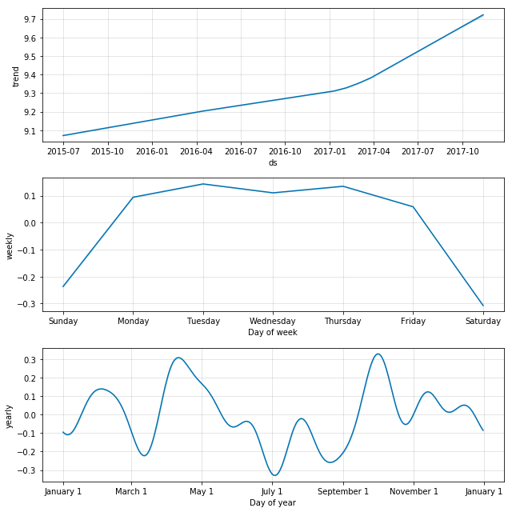

## Kaggle's "Web Traffic Time Series Forecasting" Competition

This model is my solution to Kaggle's "Web Traffic Time Series Forecasting" Competition. It makes web traffic predictions using Facebook's [Prophet](https://github.com/facebook/prophet).

### Introduction

The competition asked participants to predict web traffic of 145,000 Wikipedia articles given actual web traffic data from the prior two years.

The competition consisted of two rounds.

The first round lasted for several months. It was a preliminary round that contestants used for training and testing of models, and predictions were actually made for a period in the past (i.e., training data from mid 2015 through 2016 was used to make predictions for the first three months in 2017).

The second round lasted only a week. Here, the predictions were made for future dates (i.e., training data from the first round plus additional data from the beginning of 2017 are used to make predictions for September 2017 through November 2017). Final scores and rankings will be based on predictions from the second round only.

For more detailed information including rules and guidelines, please visit the [competition website](https://www.kaggle.com/c/web-traffic-time-series-forecasting).

### Prophet

Prophet makes predictions on time series data by combining three distinct components: a linear or logistic trend, a weekly seasonal component, and a yearly seasonal component. 

As an example, below is an example of the web traffic and forecast of Elon Musk's Wikipedia page. The black dots are actual traffic and the dark blue line is the prediction.

The three components are shown below.

The shape of the prediction makes senses. There's been an significant rise in interest in Elon Musk as seen from the trend line. Also, from the weekly graph, we can see that the interest is high during the weekdays but wanes during the weekends. The yearly component is likely related to his company's earnings and product announcements as well as his interactions with the public and the media.

### Implementation

Run the **web_traffic_forecasting_model.py** file.

*Note: Prophet can only make predictions for a single time series. Therefore, to obtain predictions for all 145,000 websites, it is necessary to loop through each individual website. This takes a very long time, and on my MacBook Pro, the model took about 4 days to finish.*

Due to space limitations on github, I do not include the input data files. To run the model, you will need to download and save the two input files to the same directory as the model. You can download those files [here](https://www.kaggle.com/c/web-traffic-time-series-forecasting/data).

### Input files for the second round

The following data files are required:
- train_2.csv
- key_2.csv

### Output file for the second round

There is only one output file, which is the submission file:
- submission_2.csv